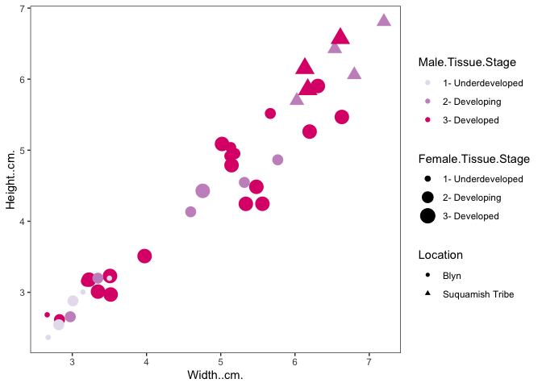
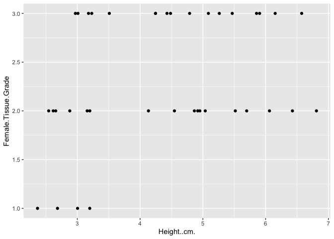
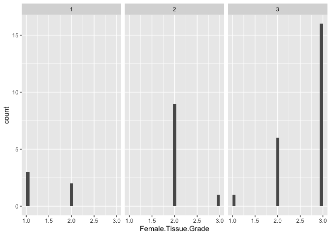
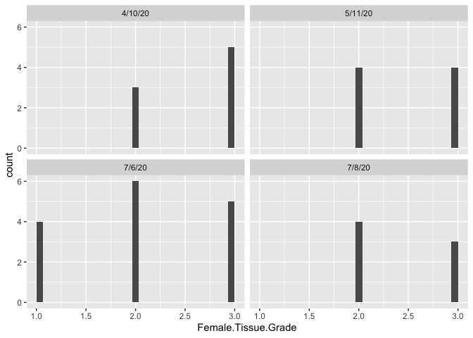
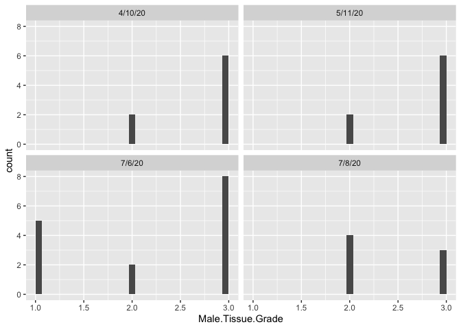
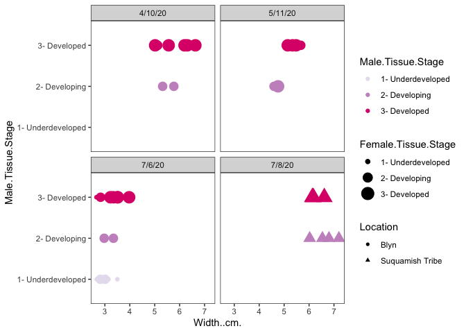
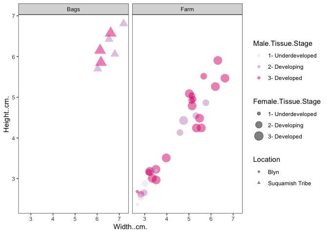
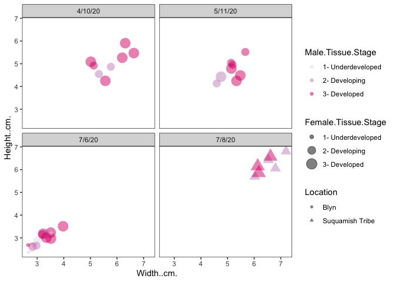
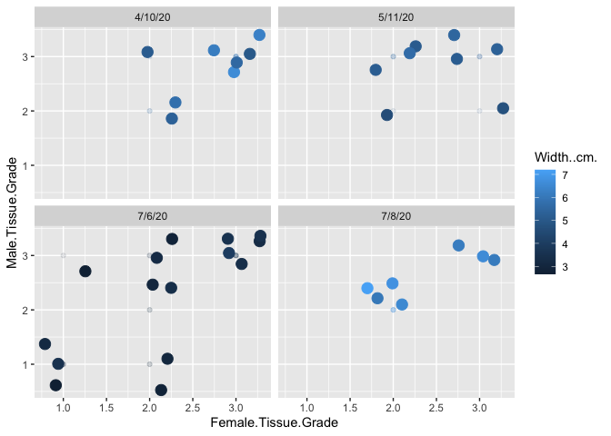

``` r
library(tidyverse)
```

    ## ── Attaching packages ─────────────────────────────────────── tidyverse 1.3.0 ──

    ## ✓ ggplot2 3.3.3     ✓ purrr   0.3.4
    ## ✓ tibble  3.1.0     ✓ dplyr   1.0.5
    ## ✓ tidyr   1.1.3     ✓ stringr 1.4.0
    ## ✓ readr   1.4.0     ✓ forcats 0.5.1

    ## ── Conflicts ────────────────────────────────────────── tidyverse_conflicts() ──
    ## x dplyr::filter() masks stats::filter()
    ## x dplyr::lag()    masks stats::lag()

``` r
clam <- read.csv("../data/cockle_data.csv")
```

``` r
ggplot(clam, aes(`Width..cm.`,`Height..cm.`,colour=`Male.Tissue.Stage`,size=`Female.Tissue.Stage`,shape=Location))+geom_point()+
theme_bw()+theme(panel.grid.major = element_blank(),
                panel.grid.minor = element_blank())+scale_colour_brewer(palette = 11)
```

    ## Warning: Using size for a discrete variable is not advised.



``` r
ggplot(clam, aes(x = Height..cm., y = Female.Tissue.Grade)) +
  geom_point()
```



``` r
ggplot(clam, aes(x = Female.Tissue.Grade)) +
  geom_histogram(bins = 30) +
  facet_wrap(~Male.Tissue.Grade)
```



``` r
ggplot(clam, aes(x = Female.Tissue.Grade)) +
  geom_histogram(bins = 30) +
  facet_wrap(~Date)
```



``` r
ggplot(clam, aes(x = Male.Tissue.Grade)) +
  geom_histogram(bins = 30) +
  facet_wrap(~Date)
```



``` r
ggplot(clam, aes(`Width..cm.`,`Male.Tissue.Stage`,colour=`Male.Tissue.Stage`,size=`Female.Tissue.Stage`,shape=Location))+geom_point()+
theme_bw()+theme(panel.grid.major = element_blank(),
                panel.grid.minor = element_blank())+scale_colour_brewer(palette = 11) +
  facet_wrap(~Date)
```

    ## Warning: Using size for a discrete variable is not advised.



``` r
ggplot(clam, aes(`Width..cm.`,`Height..cm.`,colour=`Male.Tissue.Stage`,size=`Female.Tissue.Stage`,shape=Location ))+geom_point(alpha = 0.5)+
theme_bw()+theme(panel.grid.major = element_blank(),
                panel.grid.minor = element_blank())+scale_colour_brewer(palette = 11) +
  facet_wrap(~Location.Type)
```

    ## Warning: Using size for a discrete variable is not advised.



``` r
ggplot(clam, aes(`Width..cm.`,`Height..cm.`,colour=`Male.Tissue.Stage`,size=`Female.Tissue.Stage`,shape=Location ))+geom_point(alpha = 0.5)+
theme_bw()+theme(panel.grid.major = element_blank(),
                panel.grid.minor = element_blank())+scale_colour_brewer(palette = 11) +
  facet_wrap(~Date)
```

    ## Warning: Using size for a discrete variable is not advised.



``` r
ggplot(clam, aes(x = Female.Tissue.Grade, y = Male.Tissue.Grade, color = Width..cm.)) +
  geom_point(alpha = .1) +
  geom_jitter(size = 4, width = 0.3, height = 0.5) +
  facet_wrap(~Date)
```


